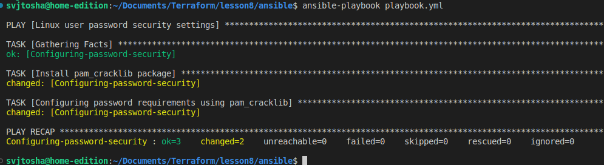
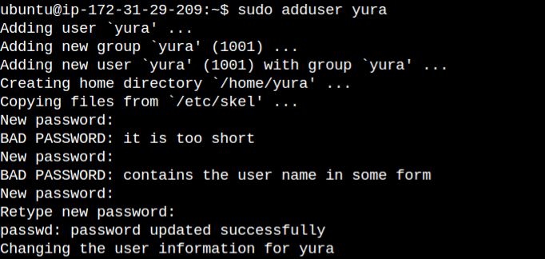

# Homework: Linux passwords hardening


I decided to do the task using the libpam_cracklib package.

I have created an ansible playbook in which the first task is to install the libpam_cracklib package on a virtual machine.

```
- name: Install pam_cracklib package
    package:
        name: "libpam-cracklib"
        state: present
```

The next task is to configure libpam_cracklib to check if the password contains the username. If so, a message is displayed that the password contains the user's name and you need to choose another password.

```
- name: Configuring password requirements using pam_cracklib
    lineinfile:
        dest: "/etc/pam.d/common-password"
        regexp: "pam_cracklib.so"
        line: "password required pam_cracklib.so try_first_pass retry=3 minlen=8 reject_username enforce_for_root"
        state: present
```
[Link on ansible playbook](https://github.com/bugaenkoyu/linux-passwords-hardening/blob/main/playbook.yml)



### Testing password security

I created a new user and checked if the password rejection works if it contains a username. 



In the first case, I entered only the username - __yura__, in the second - __yura1234__, the name and numbers, in the third, I entered a password that does not contain a name - __1Qer%5JN__.